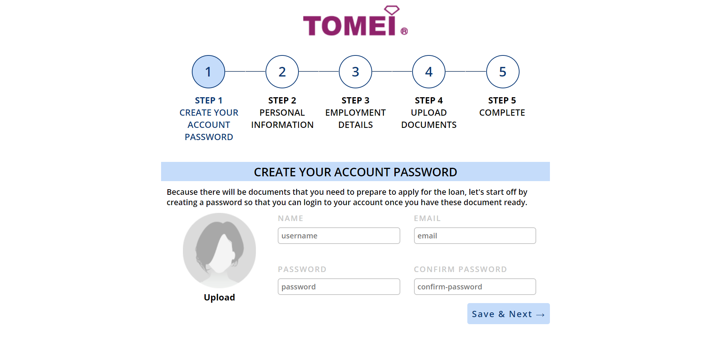
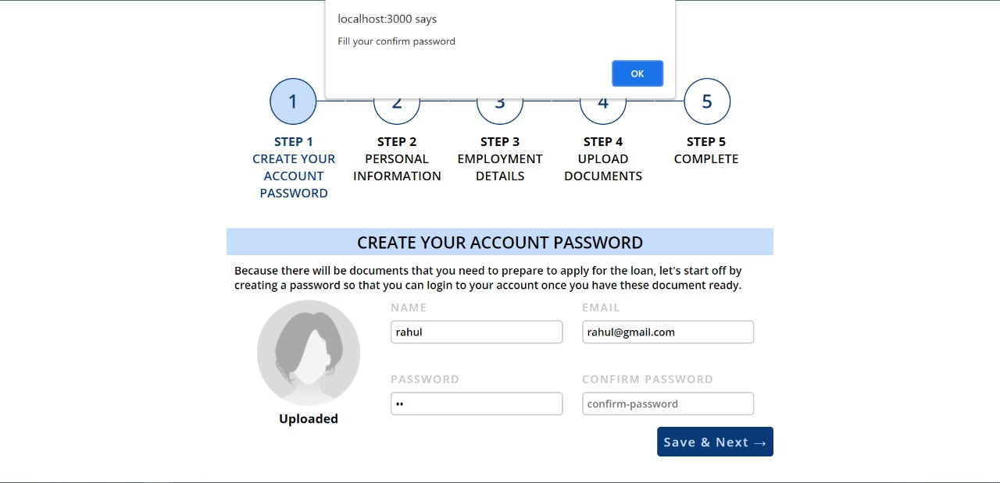
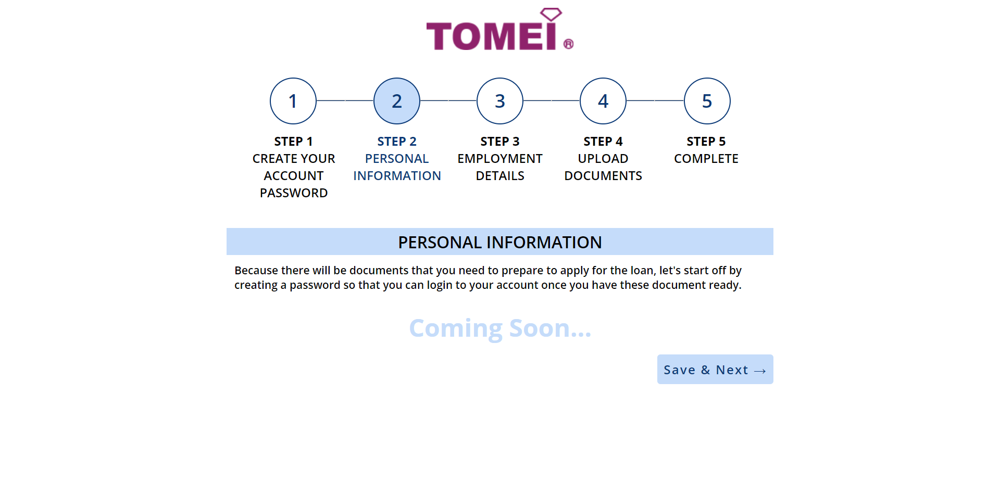
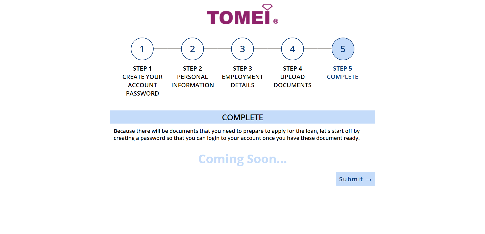

# Tomie

Test application
To run the application clone it in your device.
Make sure you have [MariaDB](https://downloads.mariadb.org/) installed in you device to check the full functionality.
# FRONTEND 

Open the project in terminal
```
cd test

npm install
```
-> `npm start` to run the frontend

-> `npm run test` to test the front-end

# BACKEND

Open the project in terminal
```
cd backend

npm install
```
-> `npm start` to run the backend

To test the full application run the backend and frontend at the same time.

## Screenshots

HomePage


Error Display


Step Progress Display


Submit Page



